<h1 align="center">FIT Software</h1>

<b>The project is created for learning purposes. If you're impressed </b>

<h2 align="center">About</h2>

```mermaid
flowchart LR
    A[Your] --> B{impressed?}
    B -- Yes --> C[Hire me 😉]
    B -- No --> E{What's wrong?}
    E -- Code --> F[Make PR]
```

Fit Software is a service designed to manage sports facilities efficiently.

> Project start: 24.05.2024r.  
Author: Michał Łuczak  
Type: Open source  
License: TODO

### Basic feature list
- Registration on the website.
- Login to the website.
- Purchasing memberships in sport facilites.
- Renewing memberships in sport facilites.
- Employee management within sport facility.
- Organizing group and individual fitness classes.
- Sending SMS notifications.
- Sending email notifications.
- Sending mobile notifications.
- Signing up for gym classes.
- Genereting raports and charts based on collected data.
- Data analisys.

## **Domain**
> Defined buisness requirements, bounding contexts and functionalities. 

### Functionalities and buisness requiremenets
#### User:
- The user is able to **sign up** in service.
- The user has **role** (customer, employee etc.).
#### Auth
- The user is able to **log in** to service.
- The user is only able to **access** what their **role** allows them to.
#### Payment
- The user is able to **pay** online.
- The user is able to **set up** a **recurring payment**.
- The payment service is able to **get money** from recurring payment.
#### Notification
- The notification service is able to **send** async **notifications** on SMS, email, mobile app etc.
#### Membership Service
- The user is able to **purchase** **membership** to some facilities.
- The user is able to **renew** **membership**.
- The user is able to **cancel membership**.
#### Employee Service
- The employers are able to **manage** their **employees**.
#### Data Analysis Service
- Data analysis service is able to **generate raports**.
- Data analysis service is able to **collect data** and **analize** them.
#### Class Scheduler Service
- The user is able to sign up to individual class with instructor.
- The user is able to sign up to group class.

### Modules and specifications
> Modules and their specification.

#### Auth Service
- User authorization.
#### Payment Service
- Processing payments.
- Generating invoices.
#### Notification Service
- Sending notifications.
#### Membership Service
- Purchasing memberships.
- Renewing memberships.
- Canceling memberships.
#### Employee Service
- Employee management.
#### Data Analysis Service
- Data analysis.
#### Class Scheduler Service
- Gym classes management.

<!--- Eraser file: https://app.eraser.io/workspace/Vwxj9n8cr8OMQBXLh7dP --->
